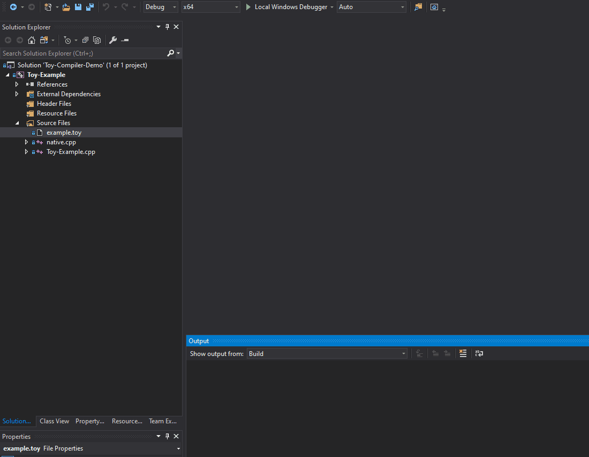

# Toy Compiler Demo that support debugging

## What is it?

I built toycc.exe as <<Writing Your Own Toy Compiler Using Flex, Bison and LLVM>>(https://gnuu.org/2009/09/18/writing-your-own-toy-compiler/) 

## What are modified?

I fixed following issues:
* built flex/bison in VS2019;
* built llvm in VS2019;
* upgraded toy compiler to use API of LLVM 9;
* added some code to support debuginfo;

## How to build and debug

## Change Logs

### 05 Jan 2020
* Create repository.
